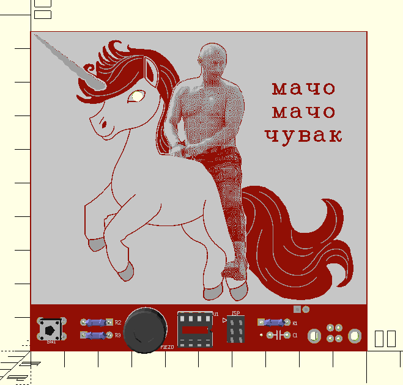
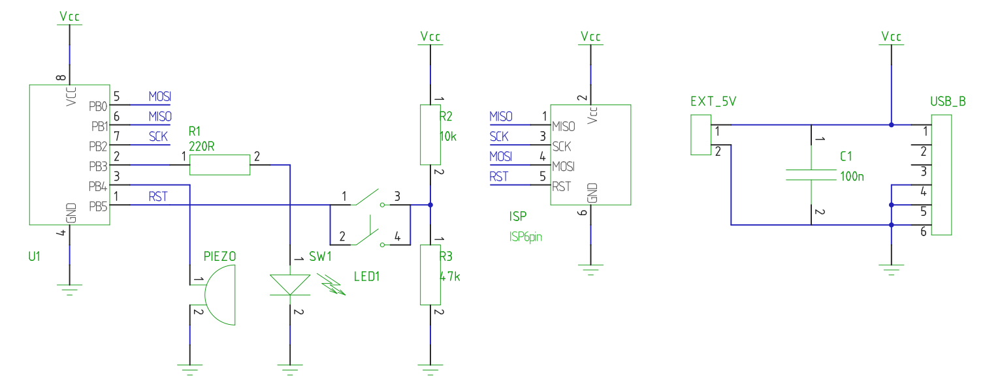

# STEM4ukraine-Macho-Macho-Man

Touch the rainbow and get poked by the Unicorn with this fun PCB.

A fun school STEM project demonstrating simple through hole soldering and digital electronics using USB to power the circuit.

The circuit is attiny microcontroller based, which manages the unicorn's LED eye, and plays music on the piezo speaker.

The prototype is currently undergoing manufacturing and testing

An openscad render of the front of the PCB:

The Macho Macho Man schematic:

